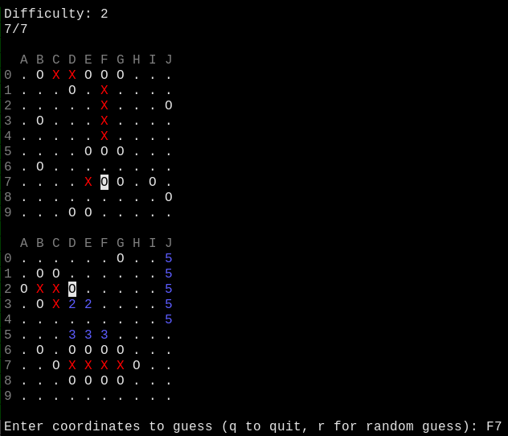

## Overview

<p align="center">
  
</p>

This is a simple console-based Battleship game written in C, where you can play
against different levels of AI or a human opponent.

## Features

- Play against different AI opponents with varying difficulty.
- The human player can manually place their ships on the board.
- Collision checks to make sure there are no invalid board placements.
- Visualization of player and opponents boards with a score readout.
- Fully interactive gameplay.
- Gracefully handles SIGINT.
- ANSI color support.

## Setup

`make build` to build the program, and `make run` to run it.

## Dependencies

```
gcc
make
```

## AI Levels

- Easy: AI makes random guesses.
- Medium: AI makes semi-intelligent guesses based on prior hits.
- Hard: AI has a small chance to cheat by hitting directly on ships.

## License

This work is licensed under the GNU General Public License version 3 (GPLv3).

[](https://www.gnu.org/licenses/gpl-3.0.en.html)
